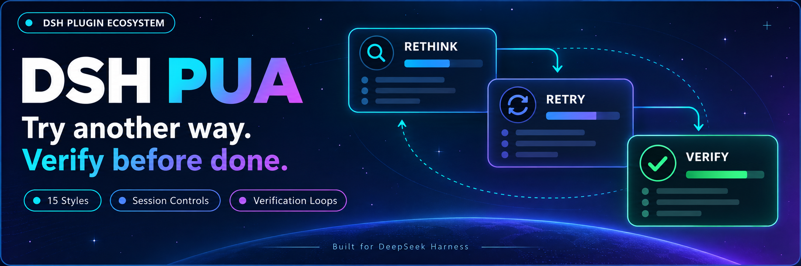
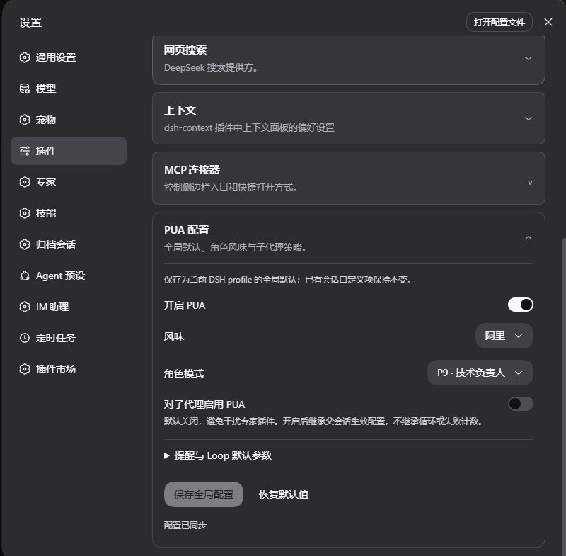
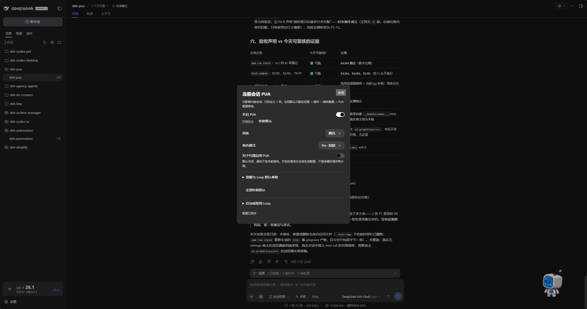

<p align="center">
  
</p>

<div align="center">

# DSH PUA

**Help your agent try another approach and verify its work before calling it done.**

[简体中文](README.zh-CN.md) · [Features](#features) · [Screenshots](#screenshots) · [Installation](#installation) · [Usage](#usage) · [Configuration](#configuration) · [Commands](#common-commands) · [Changelog](CHANGELOG.md)

[](https://www.npmjs.com/package/@michengai/dsh-pua)
[](https://www.npmjs.com/package/@michengai/dsh-pua)
[](https://github.com/MichengAI/dsh-pua/actions/workflows/ci.yml)
[](LICENSE)
[](https://github.com/deepseek-ai/deepseek-harness)
[](https://nodejs.org/)

</div>

> DSH PUA brings [PUA](https://github.com/tanweai/pua) to DeepSeek Harness. When an agent repeatedly fails, gives up too early, or claims completion without checking, it encourages a different approach, investigation, and evidence. Community-maintained; not an official DeepSeek AI or PUA product.

## Features

- **Try another approach**: prompt the agent to reconsider its reasoning instead of repeating ineffective attempts.
- **Check before claiming completion**: encourage verification and evidence for the result.
- **Choose a style**: 15 company-inspired styles, plus P7, P9, P10, encouragement, motherly, and other persona modes.
- **Configure through the UI**: save global defaults in plugin settings and adjust individual conversations from chat.
- **Continue based on verification**: start a Loop to keep working until verification passes, the iteration limit is reached, or you cancel.

Results depend on the model and task. The plugin does not guarantee a solution every time.

## Screenshots

### Global settings

Open Settings → Plugins → PUA Configuration to set default enablement, style, persona, and subagent behavior. Screenshots show the Chinese interface.



### Current conversation

Click **PUA** to the right of Experts to adjust the current conversation. Restore individual defaults or start and cancel a Loop from the same panel.



## DSH product ecosystem

For a desktop workbench, download [DSH Codex Desktop](https://github.com/MichengAI/dsh-codex-desktop/releases). Existing [DeepSeek Harness](https://github.com/deepseek-ai/deepseek-harness) installations can add plugins as needed by following each project's README. Below are 11 first-party plugins; consult the corresponding desktop release notes and bundled catalog for what that version includes.

| Plugin | What you can do |
| --- | --- |
| [Codex UI](https://github.com/MichengAI/dsh-codex-ui) | Organize projects and conversations, search tasks, and navigate chat turns |
| [Agency Agents](https://github.com/MichengAI/dsh-agency-agents) | Choose and summon specialists for your task |
| [Skills Manager](https://github.com/MichengAI/dsh-skills-manager) | Find, enable, create, and import local skills |
| [Archive Manager](https://github.com/MichengAI/dsh-archive-manager) | Search, restore, or clean up archived conversations |
| [IM Connect](https://github.com/MichengAI/dsh-im-connect) | Send tasks and receive replies through messaging platforms |
| [Automation](https://github.com/MichengAI/dsh-automation) | Schedule tasks and review each run |
| [BTW](https://github.com/MichengAI/dsh-btw) | Ask side questions without interrupting the main task |
| [Simplify](https://github.com/MichengAI/dsh-simplify) | Use `/simplify` to improve code within your Git changes |
| [PUA](https://github.com/MichengAI/dsh-pua) | Guide the Agent to try new approaches after failures, investigate causes, and verify results before completion |
| [Code Review](https://github.com/MichengAI/dsh-code-review) | Use `/review` to request an independent Agent code review and receive the report in the current conversation |
| [Codex Pet](https://github.com/MichengAI/dsh-codex-pet) | View conversation notifications and respond to tool approvals and questions through a desktop pet |

## Installation

Requires Node.js 22.19 or later and DSH `0.1.2-rc.1`, `0.1.5-rc.1`, `0.1.5-rc.2`, `0.1.6-alpha.1`, or `0.1.6-alpha.2`. Uses your existing DSH model configuration; no additional API key is needed.

Examples use the `web` profile. Replace it with the profile you use.

### Ask an agent to install it

Send this to an agent that can run commands on your computer:

```text
Install @michengai/dsh-pua into my local DSH web profile by running dsh plugin --profile web add @michengai/dsh-pua@latest --registry=https://registry.npmjs.org/. Check that the plugin loads, then explain how to open PUA settings.
```

### Install manually

```powershell
[Console]::OutputEncoding = [System.Text.Encoding]::UTF8
$OutputEncoding = [System.Text.Encoding]::UTF8
dsh plugin --profile web add @michengai/dsh-pua@latest --registry=https://registry.npmjs.org/
```

After the current task finishes, reload DSH or restart its Web service. Refreshing the browser alone is not enough. Enter `/pua help` to check that the plugin is available.

## Usage

1. Open Settings → Plugins and expand PUA Configuration in the first plugin-configuration tab.
2. Enable PUA, choose a style and persona, and save.
3. Return to chat and submit tasks as usual.

**PUA** appears to the right of Experts in the composer. Click it to view or adjust the current conversation. The label has a diagonal strike when PUA is disabled for that conversation; disabling it globally hides the entry.

## Configuration

**Change global defaults only in plugin settings. Chat controls and commands affect only the current conversation.**

Unchanged options follow global defaults. Editing an option overrides just that option. Choose Restore default to follow the global value again, or restore all options at once.

| Option | What it does |
| --- | --- |
| Enable PUA | Enabled by default; can be disabled for an individual conversation |
| Style and persona | Select a style automatically or choose a specific style and persona |
| Enable for subagents | Off by default; enable when specialists and other subagents should also use PUA |
| Correction reminders | Adjust terminal checks, failure escalation, and quality reminders |
| Feedback reminders | Change reminder frequency or turn reminders off; feedback is not uploaded |
| Loop defaults | Set a verification command, timeout, and iteration limit |

Since `0.3.0`, commands no longer change global settings. Subagent enablement also depends on the parent conversation's PUA switch.

### Continue until verification passes

In the chat PUA panel, enter a Loop task, verification command, and iteration limit, then start it. For example, ask the agent to fix failing tests, verify with `npm test`, and stop after at most 10 iterations.

You can also enter:

```text
/pua loop "Fix the failing tests and add regression coverage" --verify "npm test" --max-iterations 10
```

Enter `/cancel-pua-loop` to stop. Disabling PUA for the current conversation also cancels its Loop, but does not undo operations already performed.

Set a verification command and iteration limit when using a Loop. Without a verification command, completion relies on the model's report. An iteration limit of 0 means unlimited iterations.

## Common commands

Everyday switches, styles, and personas are available in the UI; memorizing commands is optional.

| Goal | Command |
| --- | --- |
| Enable or disable PUA for this conversation | `/pua on`, `/pua off` |
| Choose a style | `/pua flavor huawei` |
| Ask for another approach | `/pua again` |
| Check whether the task is complete | `/pua done-check` |
| Check delivery evidence | `/pua evidence` |
| Review current changes without editing | `/pua review` |
| Restore global defaults for this conversation | `/pua reset` |
| Cancel a verification Loop | `/cancel-pua-loop` |
| View status or full usage | `/pua status`, `/pua help` |

## Uninstall

```powershell
[Console]::OutputEncoding = [System.Text.Encoding]::UTF8
$OutputEncoding = [System.Text.Encoding]::UTF8
dsh plugin --profile web remove @michengai/dsh-pua
```

Reload DSH for the change to take effect. Project files and conversation history are preserved.

## License and attribution

Adapted from [tanweai/pua](https://github.com/tanweai/pua) 3.5.1. Persona and collaboration capabilities depend on what DSH supports.

Original project code uses [Apache License 2.0](LICENSE). Bundled PUA assets retain their upstream-declared MIT license and attribution; see [NOTICE](NOTICE).
